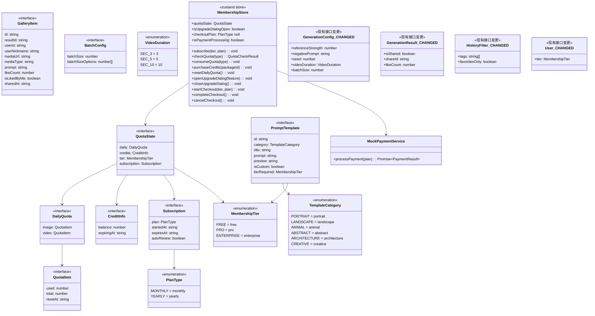
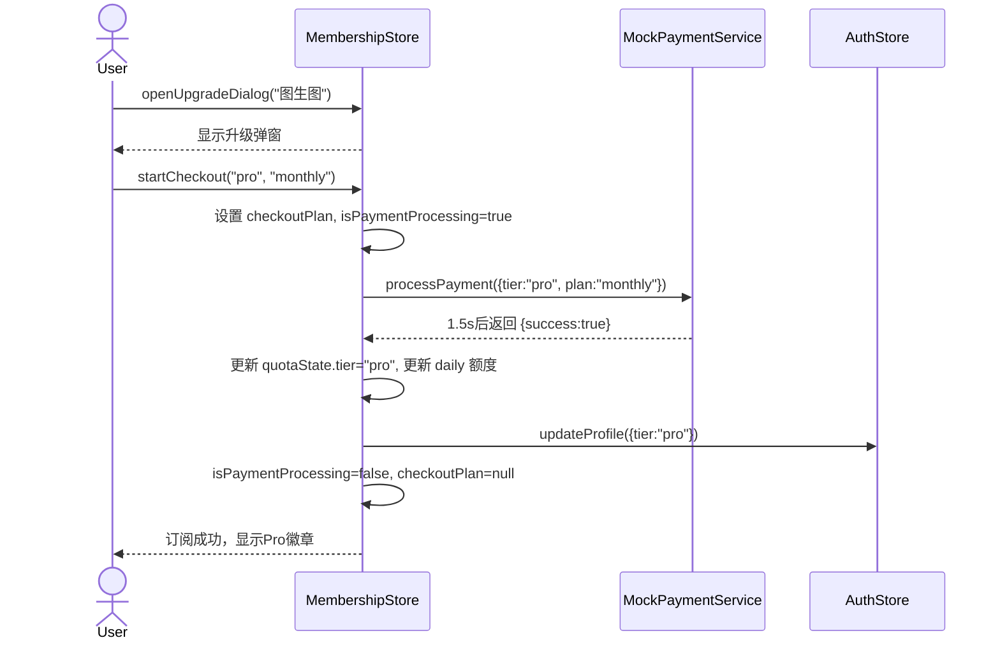
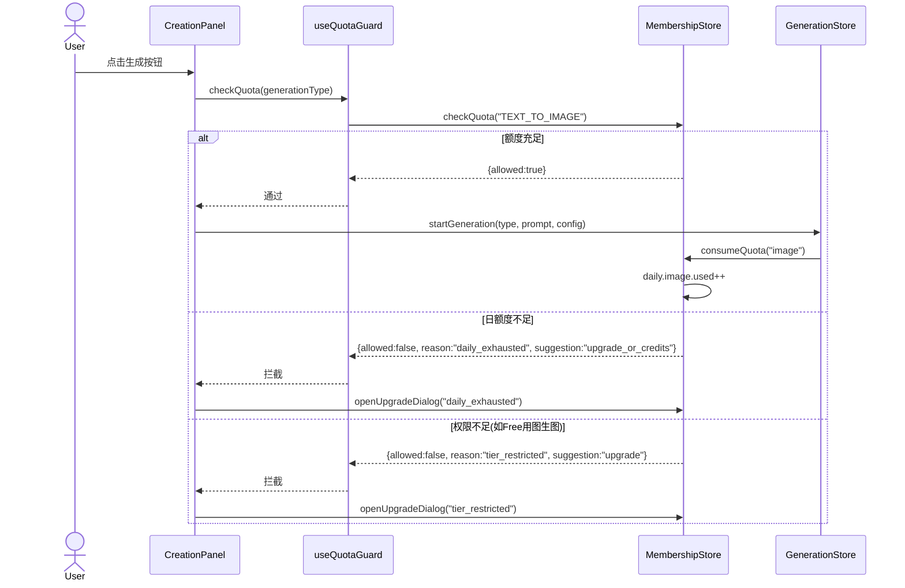
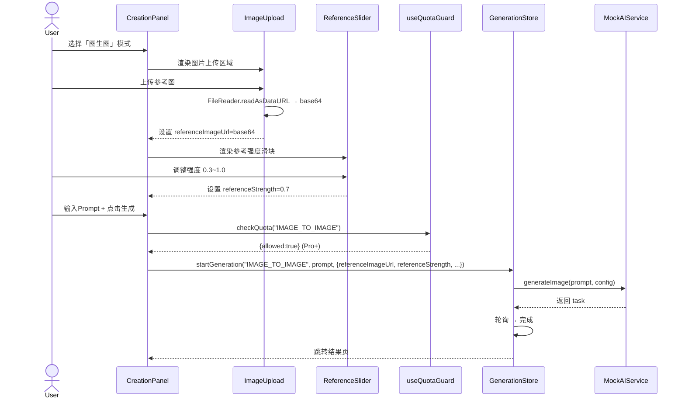
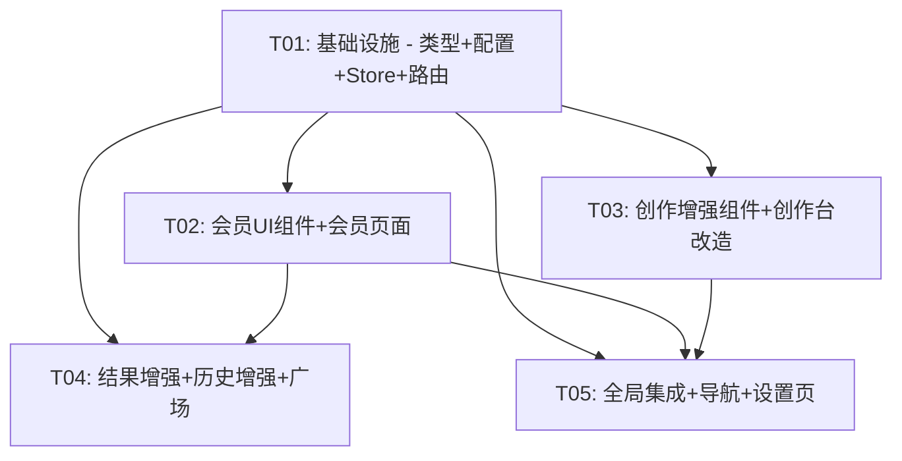

# 增量架构设计 v2 — AI 媒体创作平台

> 基于 PRD v2 的增量架构设计，遵循最小变更原则，在现有代码基础上扩展会员体系与功能增强。

---

## 1. 增量实现方案

### 1.1 核心技术挑战

| 挑战 | 方案 |
|------|------|
| 会员额度系统与现有生成流程的解耦 | 新增独立 `membershipStore`，通过守卫函数 `checkQuota()` 在 `startGeneration` 前拦截，不侵入现有 store 逻辑 |
| 图生图/图生视频的参考图上传 | 复用现有 `GenerationConfig.referenceImageUrl` 字段，新增 `ImageUpload` 组件将本地文件转 Base64 dataURL 赋值 |
| 批量生成的进度管理 | 在 `generationStore` 中新增 `batchTasks` 状态，并行启动多个 mock 任务，部分失败展示成功部分 |
| 社区广场瀑布流 | 纯前端 Mock 数据 + MUI CSS Grid 瀑布流，无后端依赖 |
| Mock 支付流程 | 1.5 秒 `setTimeout` 模拟，100% 成功，状态写入 `membershipStore` |

### 1.2 架构模式

延续现有 **Zustand + React Router + MUI** 架构，新增：
- **守卫模式**：额度检查函数作为生成前置守卫，升级引导弹窗作为全局拦截
- **分层组件**：会员相关 UI 组件按 `展示型(Badge/QuotaDisplay)` 和 `交互型(PlanSelector/CreditStore)` 分层
- **配置驱动**：会员等级、额度配额、模板数据等均以常量配置驱动，便于后续对接后端

---

## 2. 新增文件列表及相对路径

```
src/
├── stores/
│   └── membershipStore.ts              # 会员状态管理
├── services/
│   └── mockPaymentService.ts           # Mock 支付服务
├── hooks/
│   ├── useMembership.ts                # 会员 Hook
│   └── useQuotaGuard.ts               # 额度守卫 Hook
├── components/
│   ├── membership/
│   │   ├── MemberBadge.tsx             # 会员徽章
│   │   ├── QuotaDisplay.tsx            # 额度展示
│   │   ├── UpgradeHint.tsx             # 升级引导
│   │   ├── PricingTable.tsx            # 定价表
│   │   ├── PlanSelector.tsx            # 套餐选择器
│   │   └── CreditStore.tsx             # 积分商城
│   ├── creation/
│   │   ├── ImageUpload.tsx             # 图片上传
│   │   ├── ReferenceSlider.tsx         # 参考强度滑块
│   │   ├── PromptTemplateDrawer.tsx    # Prompt模板抽屉
│   │   ├── TemplateCard.tsx            # 模板卡片
│   │   ├── CustomTemplateSaveDialog.tsx # 自定义模板保存弹窗
│   │   ├── AdvancedSettingsPanel.tsx   # 高级参数面板
│   │   ├── ParameterSlider.tsx         # 通用参数滑块
│   │   ├── BatchGenerateToggle.tsx     # 批量生成开关
│   │   └── BatchProgress.tsx           # 批量生成进度
│   ├── result/
│   │   ├── ResultCompare.tsx           # 结果对比
│   │   ├── WatermarkOverlay.tsx        # 水印叠加
│   │   └── ShareDialog.tsx             # 分享弹窗
│   ├── history/
│   │   └── TagManager.tsx              # 标签管理
│   └── gallery/
│       ├── GalleryGrid.tsx             # 广场瀑布流
│       ├── GalleryCard.tsx             # 广场卡片
│       └── LikeButton.tsx             # 点赞按钮
├── pages/
│   ├── MembershipPage.tsx              # 会员中心
│   ├── CreditsPage.tsx                 # 积分中心
│   ├── CheckoutPage.tsx                # 结算页
│   └── GalleryPage.tsx                 # 作品广场
└── utils/
    └── membershipConfig.ts             # 会员配置常量
```

---

## 3. 现有文件变更清单

| 文件 | 变更点 |
|------|--------|
| `src/types/index.ts` | 新增 `MembershipTier` 枚举、`QuotaState`/`Subscription`/`PromptTemplate`/`VideoDuration`/`BatchConfig`/`GalleryItem`/`ShareData` 接口；`GenerationConfig` 增加 `referenceStrength`/`negativePrompt`/`seed`/`videoDuration`/`batchSize` 字段；`GenerationResult` 增加 `isShared`/`shareId`/`likeCount` 字段；`HistoryFilter` 增加 `tags`/`favoritesOnly` 字段 |
| `src/utils/constants.ts` | 新增路由 `MEMBERSHIP`/`CREDITS`/`CHECKOUT`/`GALLERY`；新增 `STORAGE_KEYS.MEMBERSHIP`；新增会员配额常量 `TIER_QUOTAS`；新增 prompt 模板数据 `PROMPT_TEMPLATES`；新增积分商品配置 `CREDIT_PACKAGES` |
| `src/stores/authStore.ts` | `User` 接口新增 `tier` 字段，`login`/`register` 默认 tier='free' |
| `src/stores/generationStore.ts` | 新增 `batchTasks` 状态及 `startBatchGeneration` 方法；`startGeneration` 内部调用额度守卫检查 |
| `src/stores/historyStore.ts` | 新增 `addTag`/`removeTag`/`getFavoriteCount`/`deleteTasks`(批量) 方法；`toggleFavorite` 加入收藏上限检查（Free 10个） |
| `src/services/mockAiService.ts` | `generateImage`/`generateVideo` 支持批量结果返回（batchSize>1 时返回多个 result） |
| `src/components/creation/CreationPanel.tsx` | 集成 ImageUpload/ReferenceSlider/PromptTemplateDrawer/AdvancedSettingsPanel/BatchGenerateToggle/QuotaDisplay |
| `src/components/layout/Sidebar.tsx` | 导航菜单新增「会员」「广场」入口，用户区域新增 MemberBadge+QuotaDisplay |
| `src/components/layout/BottomNav.tsx` | 底部导航新增「广场」Tab |
| `src/components/result/ResultActions.tsx` | 新增「分享到广场」按钮，调用 ShareDialog |
| `src/components/result/ResultPreview.tsx` | Free 用户叠加 WatermarkOverlay |
| `src/components/history/HistoryFilter.tsx` | 新增标签筛选和收藏筛选 |
| `src/components/history/HistoryItem.tsx` | 新增 TagManager 入口 |
| `src/pages/CreationPage.tsx` | 顶部新增 QuotaDisplay 额度条 |
| `src/pages/HistoryPage.tsx` | 新增批量操作按钮，收藏上限提示 |
| `src/pages/ResultPage.tsx` | 集成 ResultCompare/ShareDialog，Free 用户水印提示 |
| `src/pages/SettingsPage.tsx` | 新增「会员中心」入口卡片（含 MemberBadge+QuotaDisplay+升级续费链接） |
| `src/App.tsx` | 新增 4 个路由：/membership, /membership/credits, /membership/checkout, /gallery |
| `src/hooks/useGeneration.ts` | 新增 `generateWithQuotaCheck` 方法（封装额度检查+生成） |

---

## 4. 新增/变更数据结构与接口（类图）



---

## 5. 程序调用流程（时序图）

### 5.1 会员订阅流程



### 5.2 额度检查流程



### 5.3 图生图流程



---

## 6. 增量任务列表

### T01: 基础设施 — 类型扩展 + 会员配置 + Store + 路由

**源文件**：
- `src/types/index.ts`（修改）
- `src/utils/constants.ts`（修改）
- `src/utils/membershipConfig.ts`（新增）
- `src/stores/membershipStore.ts`（新增）
- `src/services/mockPaymentService.ts`（新增）
- `src/hooks/useMembership.ts`（新增）
- `src/hooks/useQuotaGuard.ts`（新增）
- `src/App.tsx`（修改：新增4条路由占位）

**依赖**：无
**优先级**：P0

**详细说明**：
- 扩展 `GenerationConfig` 增加 `referenceStrength`/`negativePrompt`/`seed`/`videoDuration`/`batchSize`
- 扩展 `GenerationResult` 增加 `isShared`/`shareId`/`likeCount`
- 扩展 `HistoryFilter` 增加 `tags`/`favoritesOnly`
- 扩展 `User` 增加 `tier`
- 新增枚举：`MembershipTier`/`PlanType`/`VideoDuration`/`TemplateCategory`
- 新增接口：`QuotaState`/`DailyQuota`/`QuotaItem`/`CreditInfo`/`Subscription`/`PromptTemplate`/`GalleryItem`/`BatchConfig`
- `membershipConfig.ts`：等级配额表、积分商品表、Prompt模板数据(6类24个)
- `membershipStore.ts`：完整会员状态管理（配额/订阅/积分/升级弹窗/支付流程），Zustand persist
- `mockPaymentService.ts`：1.5秒延迟，100%成功
- `useMembership.ts`：封装 store 读取
- `useQuotaGuard.ts`：`checkQuota()` 守卫函数
- `App.tsx` 新增 `/membership`/`/membership/credits`/`/membership/checkout`/`/gallery` 路由

---

### T02: 会员 UI 组件 + 会员页面

**源文件**：
- `src/components/membership/MemberBadge.tsx`（新增）
- `src/components/membership/QuotaDisplay.tsx`（新增）
- `src/components/membership/UpgradeHint.tsx`（新增）
- `src/components/membership/PricingTable.tsx`（新增）
- `src/components/membership/PlanSelector.tsx`（新增）
- `src/components/membership/CreditStore.tsx`（新增）
- `src/pages/MembershipPage.tsx`（新增）
- `src/pages/CreditsPage.tsx`（新增）
- `src/pages/CheckoutPage.tsx`（新增）

**依赖**：T01
**优先级**：P0

**详细说明**：
- `MemberBadge`：根据 tier 显示不同颜色徽章（Free灰/Pro金/Enterprise紫），尺寸 sm/md/lg
- `QuotaDisplay`：进度条形式展示日额度（图片/视频独立），积分余额，点击跳转会员中心
- `UpgradeHint`：内联提示条 + 可点击升级，接收 feature 参数说明需升级原因
- `PricingTable`：三栏定价对比表，年付6.8折标签，功能差异对比
- `PlanSelector`：月付/年付切换 + 当前套餐高亮 + 选择确认
- `CreditStore`：积分商品列表（6/30/100/500积分），购买按钮，积分余额展示
- `MembershipPage`：会员中心主页，集成 MemberBadge+QuotaDisplay+PricingTable+订阅管理
- `CreditsPage`：积分中心，集成 CreditStore+积分余额+过期提醒
- `CheckoutPage`：结算确认页，1.5秒支付动画，成功/失败状态

---

### T03: 创作增强组件 + 创作台改造

**源文件**：
- `src/components/creation/ImageUpload.tsx`（新增）
- `src/components/creation/ReferenceSlider.tsx`（新增）
- `src/components/creation/PromptTemplateDrawer.tsx`（新增）
- `src/components/creation/TemplateCard.tsx`（新增）
- `src/components/creation/CustomTemplateSaveDialog.tsx`（新增）
- `src/components/creation/AdvancedSettingsPanel.tsx`（新增）
- `src/components/creation/ParameterSlider.tsx`（新增）
- `src/components/creation/BatchGenerateToggle.tsx`（新增）
- `src/components/creation/BatchProgress.tsx`（新增）
- `src/components/creation/CreationPanel.tsx`（修改）
- `src/pages/CreationPage.tsx`（修改）
- `src/stores/generationStore.ts`（修改）
- `src/services/mockAiService.ts`（修改）

**依赖**：T01
**优先级**：P0

**详细说明**：
- `ImageUpload`：拖拽/点击上传，FileReader→Base64，预览+删除，限制 5MB/仅图片
- `ReferenceSlider`：MUI Slider 0.3~1.0，仅在图生图/图生视频模式显示
- `PromptTemplateDrawer`：6类 Tab，24个预设模板，Free仅3个基础，Pro全部+自定义保存入口
- `TemplateCard`：模板卡片，点击填充 Prompt，锁标识(权限不足时)
- `CustomTemplateSaveDialog`：保存当前 Prompt 为自定义模板，Pro+
- `AdvancedSettingsPanel`：折叠面板，包含创意度/步数/负面Prompt(Pro+)/种子值(Enterprise)
- `ParameterSlider`：通用滑块组件，label+value+range
- `BatchGenerateToggle`：Pro 2/4张，Enterprise 2/4/8张，Free隐藏
- `BatchProgress`：批量生成多任务进度，部分失败展示成功+失败重试
- `CreationPanel` 改造：集成上述组件，替换原有简陋的 referenceImageUrl 输入框，添加模板抽屉入口
- `CreationPage` 改造：顶部新增 QuotaDisplay 额度条
- `generationStore` 改造：新增 `batchTasks`/`startBatchGeneration`，`startGeneration` 内集成额度消费
- `mockAiService` 改造：支持 batchSize>1 时返回多个 result

---

### T04: 结果增强 + 历史增强 + 广场

**源文件**：
- `src/components/result/ResultCompare.tsx`（新增）
- `src/components/result/WatermarkOverlay.tsx`（新增）
- `src/components/result/ShareDialog.tsx`（新增）
- `src/components/result/ResultActions.tsx`（修改）
- `src/components/result/ResultPreview.tsx`（修改）
- `src/components/history/TagManager.tsx`（新增）
- `src/components/history/HistoryFilter.tsx`（修改）
- `src/components/history/HistoryItem.tsx`（修改）
- `src/components/gallery/GalleryGrid.tsx`（新增）
- `src/components/gallery/GalleryCard.tsx`（新增）
- `src/components/gallery/LikeButton.tsx`（新增）
- `src/pages/ResultPage.tsx`（修改）
- `src/pages/HistoryPage.tsx`（修改）
- `src/pages/GalleryPage.tsx`（新增）
- `src/stores/historyStore.ts`（修改）

**依赖**：T01, T02
**优先级**：P1

**详细说明**：
- `ResultCompare`：图生图结果与原图对比（左右/滑动对比模式）
- `WatermarkOverlay`：CSS position:absolute 叠加半透明水印文字，Free 用户显示
- `ShareDialog`：分享到广场确认弹窗，填写分享描述，Mock 分享成功
- `ResultActions` 改造：新增「分享到广场」按钮，收藏上限检查
- `ResultPreview` 改造：Free 用户叠加 WatermarkOverlay
- `TagManager`：标签 CRUD，Pro+ 自定义标签，ChipInput 交互
- `HistoryFilter` 改造：新增标签多选筛选 + 仅看收藏开关
- `HistoryItem` 改造：新增 TagManager 入口
- `GalleryGrid`：CSS Grid 瀑布流布局，Mock 30+ 作品数据
- `GalleryCard`：卡片展示（图片+Prompt+用户+点赞数），点击查看大图
- `LikeButton`：点赞/取消点赞，数字动画
- `ResultPage` 改造：集成 ResultCompare/ShareDialog，Free 水印提示
- `HistoryPage` 改造：批量操作（多选删除），收藏上限提示
- `GalleryPage`：广场主页，集成 GalleryGrid+LikeButton
- `historyStore` 改造：新增 `addTag`/`removeTag`/`getFavoriteCount`/`deleteTasks`，收藏上限逻辑

---

### T05: 全局集成 + 导航改造 + 设置页改造

**源文件**：
- `src/components/layout/Sidebar.tsx`（修改）
- `src/components/layout/BottomNav.tsx`（修改）
- `src/pages/SettingsPage.tsx`（修改）
- `src/stores/authStore.ts`（修改）
- `src/hooks/useGeneration.ts`（修改）

**依赖**：T01, T02, T03
**优先级**：P1

**详细说明**：
- `Sidebar` 改造：导航菜单新增「会员中心」「作品广场」入口；用户区域新增 MemberBadge + QuotaDisplay 精简版
- `BottomNav` 改造：底部导航新增「广场」Tab（4Tab布局：创作/历史/广场/设置）
- `SettingsPage` 改造：新增「会员中心」入口卡片（含 MemberBadge + 当前套餐 + 额度概览 + 升级/续费/积分链接），替换原「服务设置」Mock 开关区域
- `authStore` 改造：`User` 新增 `tier` 字段，`login`/`register` 默认 tier='free'
- `useGeneration` 改造：新增 `generateWithQuotaCheck` 封装额度检查+生成；导出 `useQuotaGuard`

---

## 7. 新增依赖包列表

```
无新增第三方依赖。
```

所有增量功能均可基于现有技术栈（React 18 + MUI 5 + Zustand 4 + React Router 6）实现：
- 图片上传：FileReader API（浏览器原生）
- 瀑布流：CSS Grid + MUI Grid
- 支付动画：MUI CircularProgress + setTimeout
- 水印：CSS position:absolute overlay
- 滑块/折叠面板：MUI Slider / MUI Collapse

---

## 8. 共享知识更新

```
- 会员等级：Free / Pro / Enterprise，Enterprise 本次 UI 展示但功能与 Pro 一致
- 额度系统：日额度(图片/视频独立,每日00:00重置) + 积分(跨日累积,可购买)
- 额度检查统一通过 useQuotaGuard.checkQuota() 守卫函数，不直接操作 membershipStore
- 所有付费操作（订阅/积分购买）走 mockPaymentService，1.5秒延迟，100%成功
- 年付折扣固定 6.8 折，在 PricingTable 和 CheckoutPage 中体现
- 积分过期时间展示但不实际清除逻辑
- Free 用户水印使用前端 CSS 叠加（position:absolute overlay），不修改原图
- 批量生成部分失败：展示成功部分 + 失败项标记可重试
- 图生图/图生视频的参考图使用 Base64 dataURL，存储在 GenerationConfig.referenceImageUrl
- Prompt 模板 6 类 24 个预设：人像/风景/动物/抽象/建筑/创意，Free 仅 3 个基础，Pro 全部+自定义
- 收藏上限：Free 10 个，Pro 不限；超出时弹升级引导
- 自定义标签 CRUD：Pro+ 功能，标签存储在 GenerationResult.tags
- 社区广场数据为前端 Mock，30+ 条假数据
- 分享到广场：Mock 操作，isShared=true，生成 shareId
- 新增路由：/membership, /membership/credits, /membership/checkout, /gallery
- Zustand persist：membershipStore 使用 persist 中间件，key='ai_media_membership'
- 额度日重置：前端定时器检查 resetAt，到期自动重置 used=0
```

---

## 9. 待明确事项

1. **积分兑换额度的比例**：PRD 未明确积分与日额度的兑换比例，暂假设 1 积分 = 1 次图片生成额度
2. **自定义模板存储上限**：Pro 用户可保存多少自定义模板？暂不设上限，存储在 membershipStore 中
3. **社区广场 Mock 数据来源**：是否需要从历史记录中挑选分享，还是纯硬编码假数据？暂采用硬编码 + 可选分享
4. **批量生成并发策略**：Mock 阶段并行启动多个 simulateProgress，实际对浏览器性能影响待评估
5. **移动端瀑布流性能**：30+ 卡片在低端设备滚动性能待验证，可能需要虚拟化列表
6. **额度重置时区**：固定 00:00 重置，但未明确使用用户本地时区还是 UTC+8，暂按本地时区

---

## 任务依赖图


