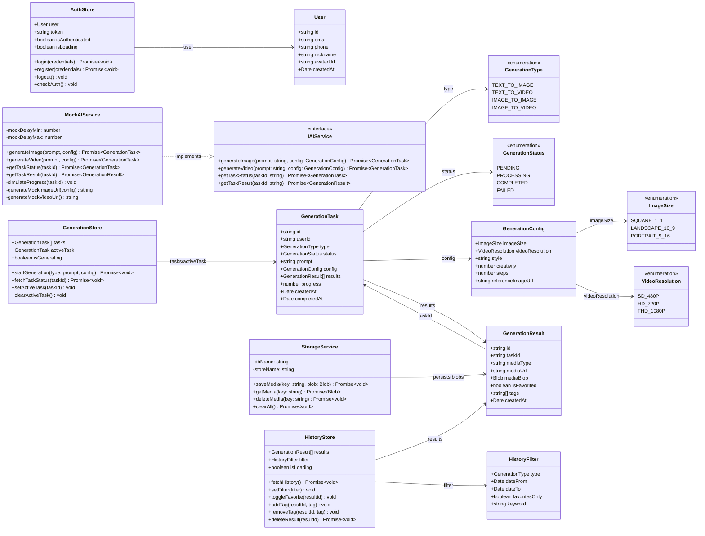
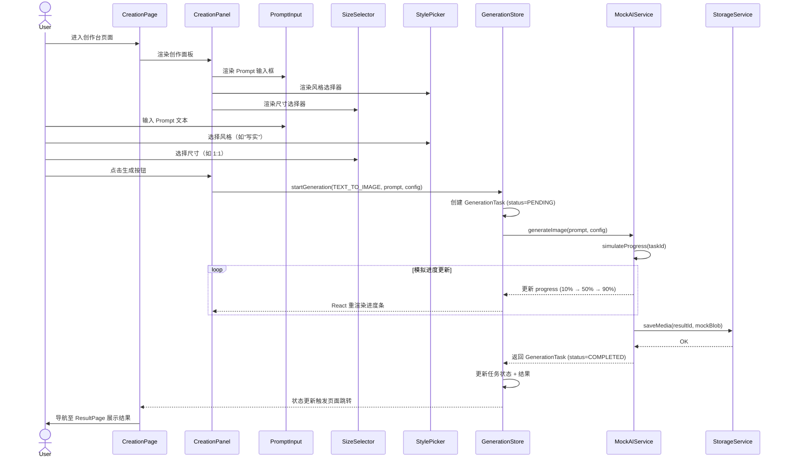
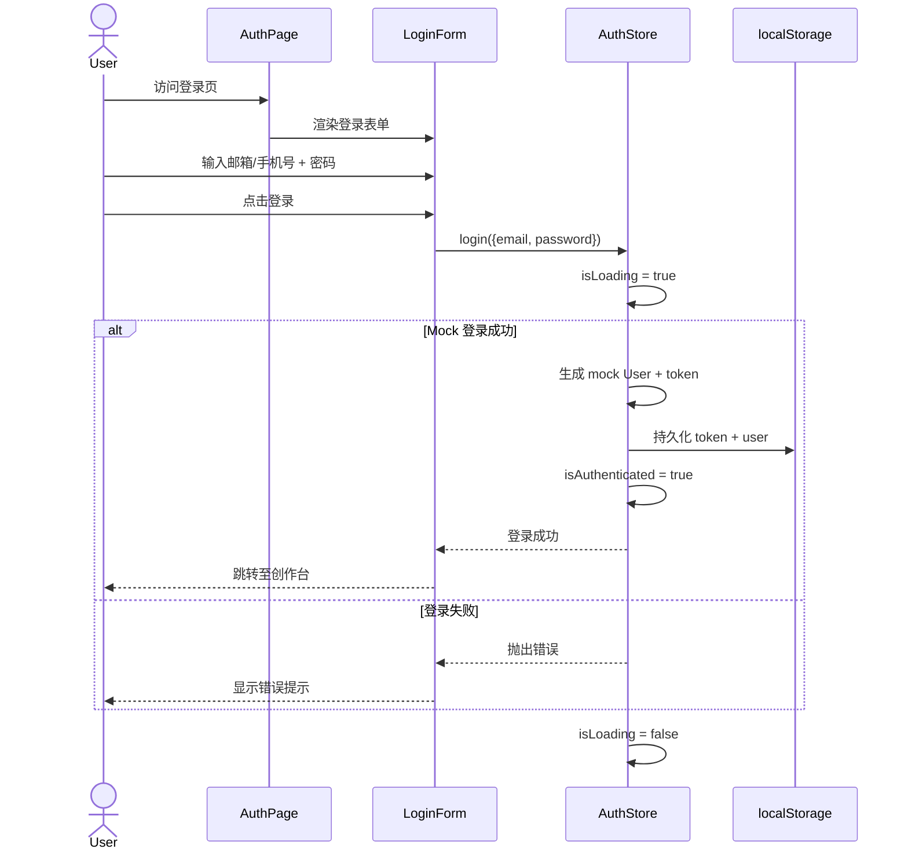
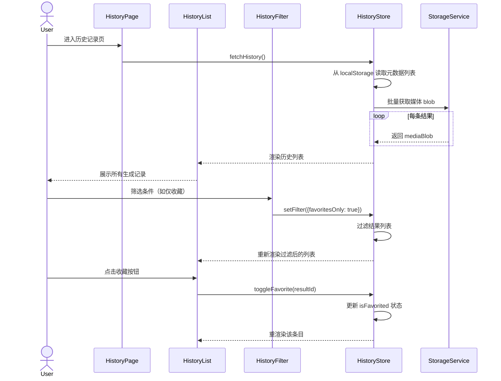
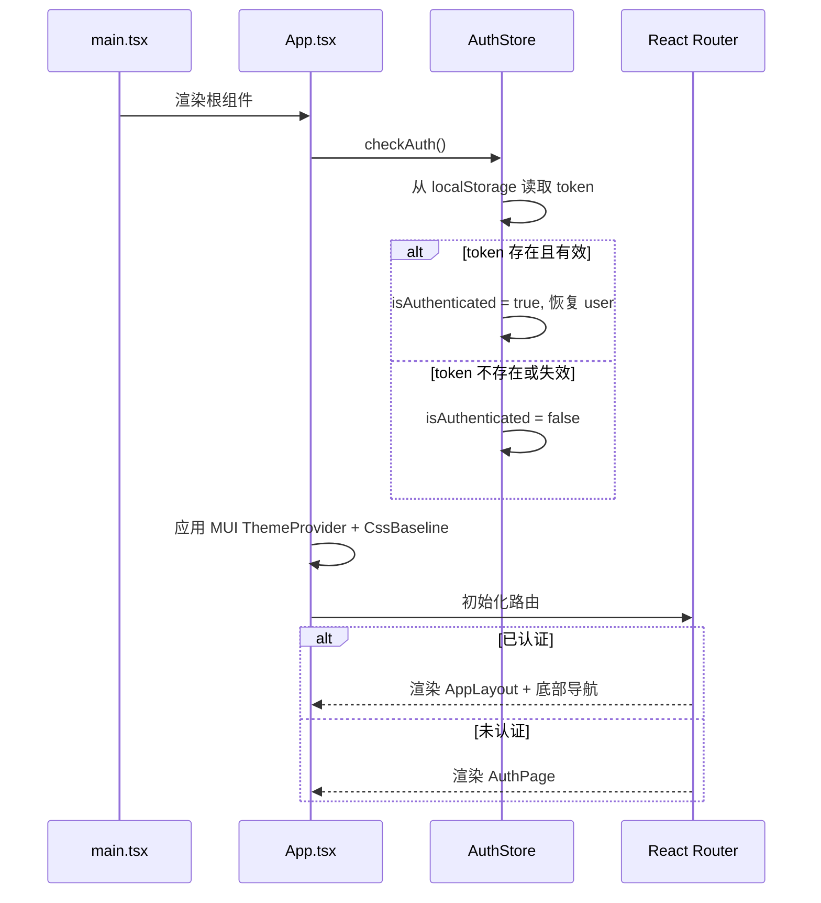
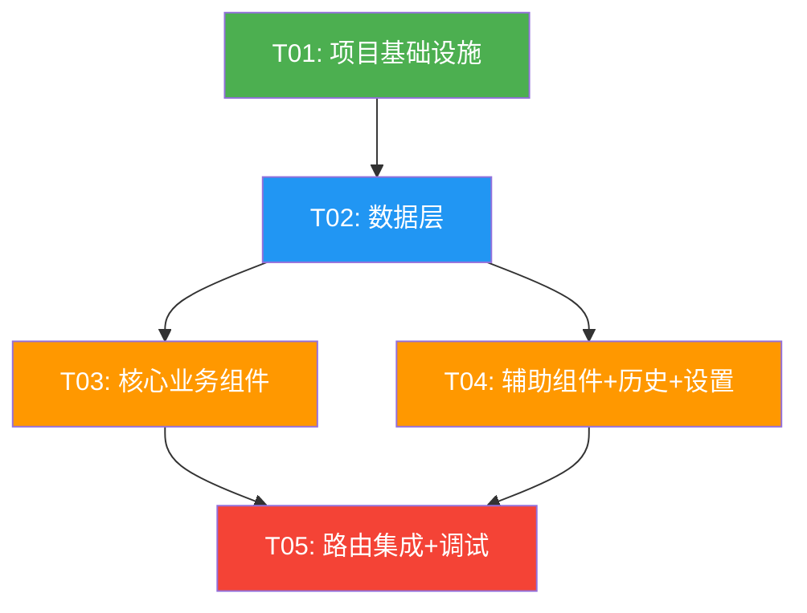

# AIGen Media — 系统架构设计

> 项目名：aigen_media  
> 技术栈：Vite + React + TypeScript + MUI + Tailwind CSS + Zustand  
> 架构师：高见远（Gao）  
> 日期：2026-06-01

---

## 目录

1. [实现方案与框架选型](#1-实现方案与框架选型)
2. [文件列表及相对路径](#2-文件列表及相对路径)
3. [数据结构与接口（类图）](#3-数据结构与接口类图)
4. [程序调用流程（时序图）](#4-程序调用流程时序图)
5. [任务列表](#5-任务列表)
6. [依赖包列表](#6-依赖包列表)
7. [共享知识](#7-共享知识)
8. [待明确事项](#8-待明确事项)

---

## 1. 实现方案与框架选型

### 1.1 核心技术挑战

| 挑战 | 说明 | 应对策略 |
|------|------|---------|
| AI 生成接口抽象 | MVP 使用 mock，后续替换真实 API | 定义统一的 `AIService` 接口层，通过适配器模式切换实现 |
| 生成任务异步管理 | 文生图/文生视频耗时较长，需后台执行 | 使用 Zustand 管理任务队列状态，轮询机制模拟进度 |
| 大量媒体资源本地存储 | 图片/视频数据量大，localStorage 容量有限 | 使用 IndexedDB 存储媒体 blob，localStorage 仅存元数据 |
| 移动端适配 | 需要响应式布局 | MUI 响应式断点 + Tailwind 响应式工具类 |
| 认证状态持久化 | 用户登录态需跨会话保持 | JWT token 存储于 localStorage，Zustand 持久化中间件 |

### 1.2 框架与库选型

| 类别 | 选型 | 理由 |
|------|------|------|
| 构建工具 | Vite 5 | 极速 HMR，原生 ESM，零配置 TypeScript |
| UI 框架 | React 18 | 成熟生态，Concurrent 特性，团队熟悉 |
| 类型系统 | TypeScript 5 | 类型安全，减少运行时错误，提升开发体验 |
| 组件库 | MUI 5 | 企业级组件库，主题定制能力强，无障碍支持 |
| CSS 工具 | Tailwind CSS 3 | 原子化 CSS，快速布局，与 MUI 互补 |
| 状态管理 | Zustand 4 | 轻量（~1KB），无 boilerplate，内置持久化中间件 |
| 路由 | React Router 6 | 声明式路由，数据路由器，懒加载支持 |
| 本地存储 | idb-keyval | IndexedDB 轻量封装，Promise API |
| 唯一 ID | uuid | 生成任务 ID、用户 ID 等唯一标识 |
| 图标 | @mui/icons-material | MUI 官方图标库，风格统一 |
| 日期处理 | date-fns | 轻量级日期库，tree-shakable |

### 1.3 架构模式

采用 **分层架构 + 适配器模式**：

```
┌──────────────────────────────────────────┐
│             Presentation Layer           │
│  (Pages + Components + MUI + Tailwind)   │
├──────────────────────────────────────────┤
│              State Layer                 │
│  (Zustand Stores + Persist Middleware)   │
├──────────────────────────────────────────┤
│             Service Layer                │
│  (AIService Adapter + StorageService)    │
├──────────────────────────────────────────┤
│             Data Layer                   │
│  (IndexedDB + localStorage + Mock Data)  │
└──────────────────────────────────────────┘
```

**关键设计决策**：
- **AIService 适配器**：定义 `IAIService` 接口，`MockAIService` 实现 mock 逻辑，后续 `RealAIService` 对接真实 API，通过工厂函数切换
- **Zustand Store 分域**：按功能域拆分 Store（auth、generation、history），避免单一大 Store
- **媒体存储分离**：元数据存 localStorage（Zustand persist），二进制数据存 IndexedDB

---

## 2. 文件列表及相对路径

```
aigen_media/
├── index.html                              # 入口 HTML
├── package.json                            # 依赖声明
├── vite.config.ts                          # Vite 配置
├── tsconfig.json                           # TypeScript 配置
├── tsconfig.node.json                      # Node 端 TS 配置
├── tailwind.config.ts                      # Tailwind 配置
├── postcss.config.js                       # PostCSS 配置
├── .eslintrc.cjs                           # ESLint 配置
├── public/
│   └── favicon.ico                         # 站点图标
├── src/
│   ├── main.tsx                            # 应用入口
│   ├── App.tsx                             # 根组件（路由 + 主题 + 全局布局）
│   ├── vite-env.d.ts                       # Vite 类型声明
│   │
│   ├── theme/
│   │   └── index.ts                        # MUI 主题定义
│   │
│   ├── types/
│   │   └── index.ts                        # 全局类型定义（Generation, User, Task 等）
│   │
│   ├── stores/
│   │   ├── authStore.ts                    # 认证状态（登录/注册/token）
│   │   ├── generationStore.ts              # 生成任务状态（队列/进度/结果）
│   │   └── historyStore.ts                 # 历史记录状态（列表/筛选/收藏）
│   │
│   ├── services/
│   │   ├── aiService.ts                    # AI 服务接口定义 + 工厂函数
│   │   ├── mockAiService.ts                # Mock AI 服务实现
│   │   └── storageService.ts              # IndexedDB 存储服务
│   │
│   ├── hooks/
│   │   ├── useGeneration.ts                # 生成任务 Hook
│   │   └── useAuth.ts                      # 认证 Hook
│   │
│   ├── components/
│   │   ├── layout/
│   │   │   ├── AppLayout.tsx               # 全局布局容器
│   │   │   ├── Sidebar.tsx                 # 侧边导航栏（桌面端）
│   │   │   └── BottomNav.tsx               # 底部导航栏（移动端）
│   │   │
│   │   ├── creation/
│   │   │   ├── PromptInput.tsx             # Prompt 文本输入框
│   │   │   ├── ModeSelector.tsx            # 模式切换 Tab（文生图/文生视频）
│   │   │   ├── StylePicker.tsx             # 风格快捷选择器
│   │   │   ├── SizeSelector.tsx            # 尺寸选择器
│   │   │   ├── GenerateButton.tsx          # 生成按钮（含 loading 状态）
│   │   │   └── CreationPanel.tsx            # 创作台面板（组合以上组件）
│   │   │
│   │   ├── result/
│   │   │   ├── ResultCard.tsx              # 单个结果卡片
│   │   │   ├── ResultGrid.tsx              # 结果网格展示
│   │   │   ├── ResultPreview.tsx           # 全屏预览弹窗
│   │   │   └── ResultActions.tsx           # 结果操作按钮（下载/收藏/删除）
│   │   │
│   │   ├── history/
│   │   │   ├── HistoryList.tsx             # 历史记录列表
│   │   │   ├── HistoryItem.tsx             # 单条历史记录
│   │   │   └── HistoryFilter.tsx           # 历史筛选器
│   │   │
│   │   └── auth/
│   │       ├── LoginForm.tsx               # 登录表单
│   │       ├── RegisterForm.tsx            # 注册表单
│   │       └── AuthGuard.tsx               # 路由鉴权守卫
│   │
│   ├── pages/
│   │   ├── CreationPage.tsx                # 创作台页面（首页）
│   │   ├── ResultPage.tsx                  # 生成结果页面
│   │   ├── HistoryPage.tsx                 # 历史记录页面
│   │   ├── SettingsPage.tsx                # 设置页面
│   │   └── AuthPage.tsx                    # 登录/注册页面
│   │
│   └── utils/
│       ├── constants.ts                    # 常量定义（尺寸、风格、API 配置等）
│       └── helpers.ts                      # 工具函数（格式化日期、文件下载等）
```

---

## 3. 数据结构与接口（类图）



---

## 4. 程序调用流程（时序图）

### 4.1 文生图主流程



### 4.2 用户认证流程



### 4.3 历史记录浏览流程



### 4.4 应用初始化流程



---

## 5. 任务列表

### T01: 项目基础设施

**说明**：搭建项目骨架，包括构建配置、入口文件、主题和类型定义。  
**源文件**：
- `package.json`
- `vite.config.ts`
- `tsconfig.json`
- `tsconfig.node.json`
- `tailwind.config.ts`
- `postcss.config.js`
- `.eslintrc.cjs`
- `index.html`
- `public/favicon.ico`
- `src/main.tsx`
- `src/App.tsx`
- `src/vite-env.d.ts`
- `src/theme/index.ts`
- `src/types/index.ts`
- `src/utils/constants.ts`
- `src/utils/helpers.ts`

**依赖**：无  
**优先级**：P0

---

### T02: 数据层（服务 + 状态管理 + 存储）

**说明**：实现 AI 服务接口及 mock 实现、Zustand Store、IndexedDB 存储服务。  
**源文件**：
- `src/services/aiService.ts`
- `src/services/mockAiService.ts`
- `src/services/storageService.ts`
- `src/stores/authStore.ts`
- `src/stores/generationStore.ts`
- `src/stores/historyStore.ts`
- `src/hooks/useAuth.ts`
- `src/hooks/useGeneration.ts`

**依赖**：T01  
**优先级**：P0

---

### T03: 核心业务组件（创作 + 结果 + 认证）

**说明**：实现创作台面板、生成结果展示、认证表单等核心业务组件及页面。  
**源文件**：
- `src/components/creation/CreationPanel.tsx`
- `src/components/creation/PromptInput.tsx`
- `src/components/creation/ModeSelector.tsx`
- `src/components/creation/StylePicker.tsx`
- `src/components/creation/SizeSelector.tsx`
- `src/components/creation/GenerateButton.tsx`
- `src/components/result/ResultCard.tsx`
- `src/components/result/ResultGrid.tsx`
- `src/components/result/ResultPreview.tsx`
- `src/components/result/ResultActions.tsx`
- `src/components/auth/LoginForm.tsx`
- `src/components/auth/RegisterForm.tsx`
- `src/components/auth/AuthGuard.tsx`
- `src/pages/CreationPage.tsx`
- `src/pages/ResultPage.tsx`
- `src/pages/AuthPage.tsx`

**依赖**：T02  
**优先级**：P0

---

### T04: 辅助组件 + 历史记录 + 设置

**说明**：实现布局导航、历史记录组件、设置页面、全局样式。  
**源文件**：
- `src/components/layout/AppLayout.tsx`
- `src/components/layout/Sidebar.tsx`
- `src/components/layout/BottomNav.tsx`
- `src/components/history/HistoryList.tsx`
- `src/components/history/HistoryItem.tsx`
- `src/components/history/HistoryFilter.tsx`
- `src/pages/HistoryPage.tsx`
- `src/pages/SettingsPage.tsx`

**依赖**：T02（仅依赖数据层，与 T03 并行）  
**优先级**：P1

---

### T05: 路由集成 + 首尾调试

**说明**：配置 React Router 路由，集成所有组件到 App 根组件，完成全局样式调优和端到端联调。  
**源文件**：
- `src/App.tsx`（修改：添加路由配置和组件集成）
- `src/main.tsx`（修改：如需调整）
- `src/theme/index.ts`（修改：如需样式微调）

**依赖**：T03, T04  
**优先级**：P0

---

### 任务依赖图



---

## 6. 依赖包列表

```
# 核心框架
- react@^18.2.0: UI 框架
- react-dom@^18.2.0: React DOM 渲染
- react-router-dom@^6.20.0: 客户端路由

# 构建工具链
- vite@^5.0.0: 构建工具
- @vitejs/plugin-react@^4.2.0: Vite React 插件
- typescript@^5.3.0: 类型系统

# UI 库
- @mui/material@^5.15.0: Material UI 组件库
- @mui/icons-material@^5.15.0: MUI 图标库
- @emotion/react@^11.11.0: MUI 样式引擎（react）
- @emotion/styled@^11.11.0: MUI 样式引擎（styled）
- tailwindcss@^3.4.0: 原子化 CSS 工具
- postcss@^8.4.0: CSS 处理器
- autoprefixer@^10.4.0: CSS 前缀自动补全

# 状态管理
- zustand@^4.4.0: 轻量级状态管理

# 数据存储
- idb-keyval@^6.2.0: IndexedDB 轻量封装

# 工具库
- uuid@^9.0.0: 唯一 ID 生成
- date-fns@^3.0.0: 日期处理

# 开发依赖
- @types/react@^18.2.0: React 类型定义
- @types/react-dom@^18.2.0: React DOM 类型定义
- @types/uuid@^9.0.0: uuid 类型定义
- eslint@^8.55.0: 代码检查
- @typescript-eslint/eslint-plugin@^6.0.0: TS ESLint 插件
- @typescript-eslint/parser@^6.0.0: TS ESLint 解析器
- eslint-plugin-react-hooks@^4.6.0: React Hooks 规则
- eslint-plugin-react-refresh@^0.4.0: React Refresh 规则
```

---

## 7. 共享知识

### 7.1 命名规范

| 类别 | 规范 | 示例 |
|------|------|------|
| 文件名 | 组件 PascalCase，其他 camelCase | `CreationPanel.tsx`, `aiService.ts` |
| 组件名 | PascalCase | `CreationPanel` |
| Store 名 | camelCase + Store 后缀 | `generationStore` |
| Hook 名 | use 前缀 + camelCase | `useGeneration` |
| 常量 | UPPER_SNAKE_CASE | `DEFAULT_IMAGE_SIZE` |
| 类型/接口 | PascalCase，接口 I 前缀 | `IAIService`, `GenerationTask` |
| 枚举 | PascalCase 枚举名，UPPER_SNAKE_CASE 值 | `GenerationStatus.COMPLETED` |

### 7.2 状态管理约定

- **Zustand Store 分域**：auth / generation / history 三个独立 Store
- **持久化策略**：authStore 和 historyStore 使用 Zustand `persist` 中间件，存储到 localStorage
- **媒体数据不经过 Store**：图片/视频 blob 仅存 IndexedDB，Store 中仅保存 mediaKey 引用
- **状态更新方式**：直接调用 Store action，不使用 dispatch/action 模式

### 7.3 API 调用模式

- **AI 服务统一通过 `createAIService()` 工厂函数获取实例**
- 当前环境 `import.meta.env.VITE_AI_SERVICE_MODE` 可设为 `'mock'` 或 `'real'`
- 所有异步操作返回 Promise，组件层通过 try/catch 处理错误
- Mock 服务模拟延迟 2-5 秒，进度分 5 步推进（0% → 20% → 50% → 80% → 100%）

### 7.4 路由结构

| 路径 | 页面 | 需认证 |
|------|------|--------|
| `/auth` | AuthPage | 否 |
| `/` | CreationPage | 是 |
| `/result/:taskId` | ResultPage | 是 |
| `/history` | HistoryPage | 是 |
| `/settings` | SettingsPage | 是 |

### 7.5 MUI 主题约定

- 主色调：`#6366F1`（Indigo-500），暗色模式适配
- 圆角：`borderRadius: 12`（卡片等组件统一圆角）
- 字体：系统默认字体栈，中文优先 `"PingFang SC", "Microsoft YaHei", sans-serif`

### 7.6 响应式断点

| 断点 | 宽度 | 导航模式 |
|------|------|---------|
| xs | < 600px | 底部 Tab 导航 |
| sm | ≥ 600px | 侧边栏导航 |
| md | ≥ 960px | 侧边栏导航 + 宽松布局 |

---

## 8. 待明确事项

| # | 问题 | 假设 | 影响范围 |
|---|------|------|---------|
| 1 | 真实 AI API 的具体端点和鉴权方式 | 后续对接时确定，当前 mock | `aiService.ts`, `mockAiService.ts` |
| 2 | Mock 文生图返回的图片来源 | 使用 picsum.photos 或本地 placeholder 图片 | `mockAiService.ts` |
| 3 | Mock 文生视频返回的视频来源 | 使用短时长示例视频 URL 或生成简单动画 | `mockAiService.ts` |
| 4 | 用户密码存储方式 | MVP 阶段 mock 验证，localStorage 明文存储（仅限开发） | `authStore.ts` |
| 5 | P1 功能（图生图、图生视频、批量生成等）的优先级排序 | MVP 不实现，但类型定义预留枚举值 | `types/index.ts` |
| 6 | 是否需要国际化 (i18n) 支持 | MVP 暂不需要，UI 文案硬编码中文 | 全局 |
| 7 | 生成结果的下载格式和分辨率 | 原始分辨率下载，格式为生成格式（PNG/MP4） | `ResultActions.tsx` |
| 8 | localStorage 容量限制下的历史记录上限 | 默认保留最近 200 条记录，超出自动清理最旧记录 | `historyStore.ts` |
